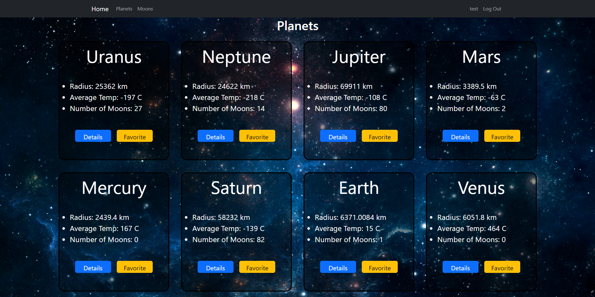
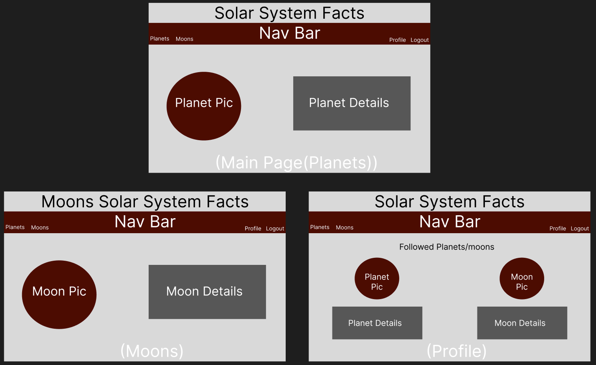
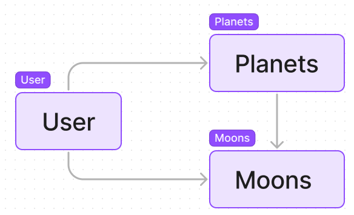

# Solar System

## Description

My project is a web application that displays data about the planets and moons in our solar system. The app presents a list of the planets, along with relevant information such as their sizes, distances from the sun, and other details. Users can browse this information by clicking on individual planets to learn more about them. Overall, my project provides a convenient and user-friendly way for people to learn about the planets and mnoons in our solar system.

 ## Technologies

- HTML
- CSS
- javaScript
- EJS
- Node
- MongoDB
- Express
- JWT
- React
- React Bootstrap
- API's
- Trello
- figma(for ERD and wireframe)

## Screenshots

 ## Wireframe

## ERD

## Trello

https://trello.com/b/gzSOtG3B/solar-system

## Future Updates

- finish moons

- add asteroids/comets

- add pictures

- implement NASA API

- Reorder Favourites

- Sort Planet/moon pages