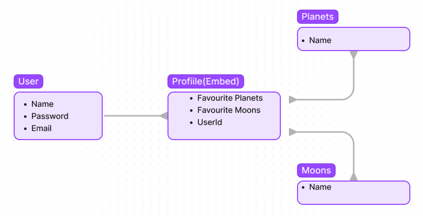

# 🌌 Exploring the Wonders of the Solar System

## Description

Welcome to my awe-inspiring web application that unveils the secrets of our magnificent solar system. Brace yourself for an extraordinary journey as you delve into a treasure trove of captivating information about the planets and moons that populate our cosmic neighborhood. Prepare to be amazed as you navigate through a galaxy of knowledge, with each click transporting you to a realm of celestial wonderment. Get ready to embark on an adventure of discovery like no other, as my project offers an immersive and user-friendly experience to unravel the mysteries of our solar system.

 ## Technologies

Unleashing the full potential of the universe requires harnessing the power of cutting-edge technologies. Here are the tools that fuel my cosmic creation:

- **HTML** 🪐: The foundation upon which the celestial journey is built.
- **CSS** 🌠: Adding style and elegance to the cosmic interface.
- **JavaScript** ⚡️: Infusing interactivity and dynamism into the cosmic experience.
- **EJS** 🌌: Templating engine for creating dynamic web pages with ease.
- **Node** 🚀: Empowering server-side applications and unleashing their full potential.
- **MongoDB** 🌙: The celestial vault that holds vast amounts of data about our solar system.
- **Express** 🌟: Speeding up the cosmic travel by providing a robust web application framework.
- **JWT** 🌟: Safeguarding the cosmic knowledge with secure authentication.
- **React** 🪐: Elevating the user experience to new celestial heights.
- **React Bootstrap** 🚀: Enhancing the cosmic interface with pre-styled components.
- **API's** 🌠: Tapping into the vast cosmic network to bring real-time information and visuals.
- **Trello** 🌌: Organizing cosmic tasks and keeping the project on track.
- **Figma** 🌠: Unleashing the power of creativity to design stellar wireframes and ERDs.

## Screenshots from the Cosmos

Step into the cosmic portal and unlock the secrets of the universe.

Embark on a celestial voyage as you navigate through the enchanting planets of our solar system.

 ## Wireframe: Blueprint of the Cosmos

Behold the blueprint that shaped the cosmic interface, laying the foundation for an immersive experience.

## ERD: Unveiling the Cosmic Connections

Witness the intricate connections between the celestial bodies in our solar system.

## Trello: The Cosmic Task Manager

Discover the meticulous planning and organization that drives the cosmic project. Journey into the Trello board and witness the celestial tasks unfold: [Trello Board](https://trello.com/b/gzSOtG3B/solar-system)

## Future Updates: Expanding the Cosmic Frontier
The cosmic adventure is far from over. Brace yourself for future updates that will expand the boundaries of exploration:

- **Finish Moons**: Unveil the hidden wonders of the moons that orbit the planets.
- **Add Asteroids/Comets**: Embark on a thrilling encounter with these cosmic wanderers.
- **Add Pictures**: Immerse yourself in breathtaking visuals that bring the cosmic beauty to life.
- **Implement NASA API**: Tap into the vast NASA archives and access a wealth of cosmic knowledge.
- **Reorder Favourites**: Take control of your cosmic journey and customize your favorite celestial bodies.
- **Sort Planet/Moon Pages**: Navigate the cosmos with ease through intuitive sorting options.